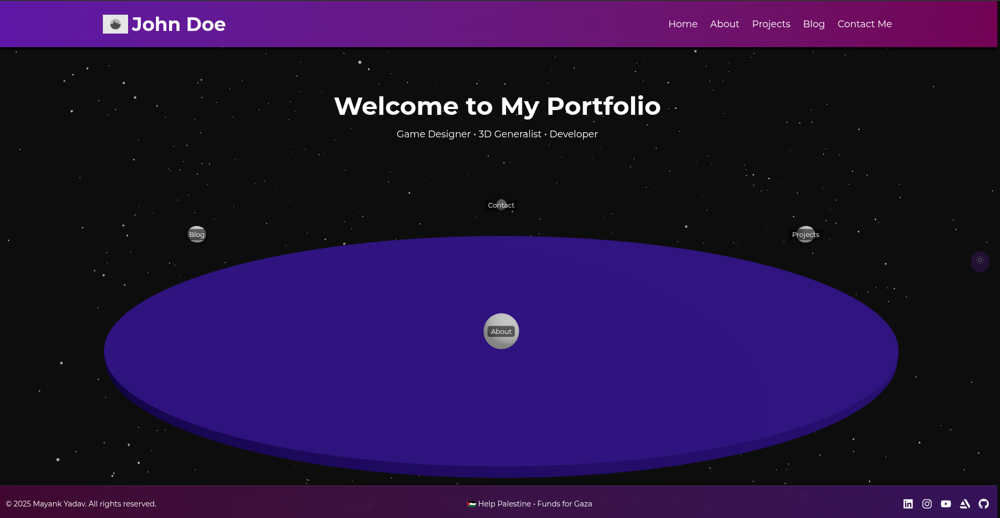
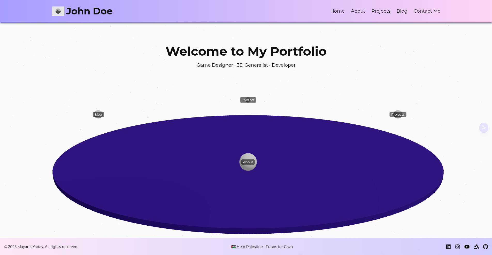
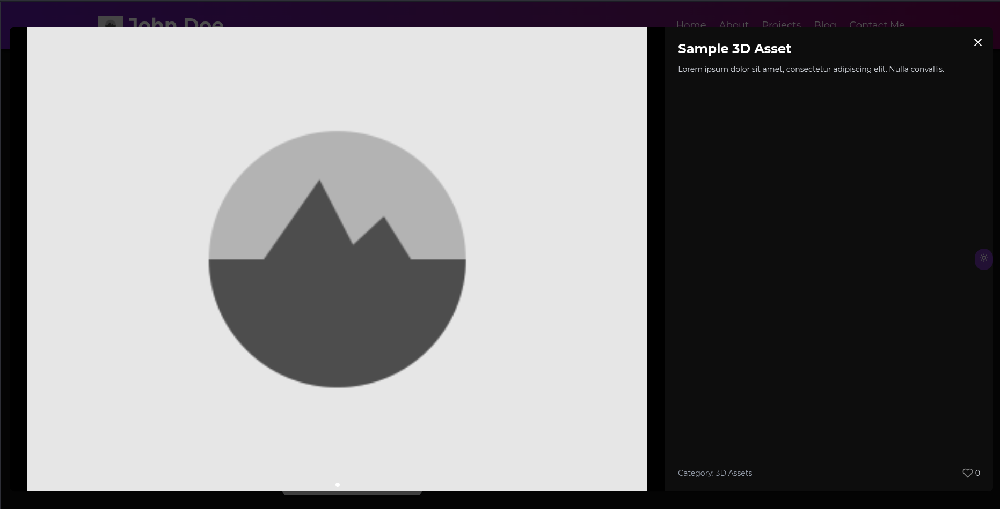

# 🌐 Astro + React + Tailwind Portfolio Template

A developer and artist-friendly portfolio template built with **Astro**, **React**, **TailwindCSS**, and **Vite**. Designed to be modern, responsive, easily customizable, and backend-ready.

---

## 🚀 Features

- 🌙 Dark/Light Theme Toggle  
- 🎨 Project Showcase (Carousel, Categories, Popup Viewer)  
- ✍️ Blog Section with Likes & Commenting  
- 💬 Comment Threads   
- 🧠 Skill Map + About + Resume Popup  
- 🧩 Modular Components for Reusability  

---

## 🛠️ Getting Started

### 1. Clone the Repo

You can follow these steps to use this code, or use this template straight from github.

```bash
git clone https://github.com/yourusername/your-portfolio-template.git
cd your-portfolio-template
```

### 2. Install Dependencies

```bash
npm install
```

### 3. Run Locally

```bash
npm run dev
```

---

## 📁 Folder Structure

You will find the code inside the src folder in the follwing structure:

```
src/
├── components/          # React components
│   ├── AboutPage/
│   ├── BlogPage/
│   ├── Common/
│   ├── ContactPage/
│   ├── HomePage/
│   ├── ProjectsPage/
│   ├── Terms&Conditions/
├── layouts/             # Astro layout files
├── pages/               # Astro pages (.astro)
│   ├── projects/
├── styles/              # Tailwind and global styles
├── utils/               # Helper functions, interfaces, mock data
```

---

### Build

```bash
npm run build
```

### Preview

```bash
npm run preview
```

---

## 📸 Screenshots





---

## 📜 Attribution

If you use this project or its structure in any way, please include the following in your credits or documentation:

```
Website template by Mayank Yadav (http://github.com/bunbun205)

Source code licensed under the MIT License.
```

---

## 🕊️ Humanitarian Appeal

This portfolio template includes a small but heartfelt message of support for humanitarian aid efforts in Palestine. As you use or modify this code, please consider keeping the links to donation resources such as:

- [PCRF – Palestine Children’s Relief Fund](https://www.pcrf.net)  
- [Funds for Gaza](https://linktr.ee/fundsforgaza)

These links serve no political purpose within this project—only a compassionate one. The devastation faced by civilians, especially children, deserves awareness and empathy. Even if you must remove them, please consider visiting the resources below and staying informed:

### Learn More:

- [ICRC – Palestine](https://www.icrc.org/en/where-we-work/middle-east/palestine)  
- [UNRWA – UN Relief and Works Agency](https://www.unrwa.org/)  
- [B’Tselem – Human Rights in the Occupied Territories](https://www.btselem.org/)

---

## ☕ Support

If you found this template helpful or want to support future work, consider supporting me through the following platforms:

- [Buy Me a Coffee ☕](https://www.buymeacoffee.com/beany159)  
- [PayPal 💸](https://www.paypal.me/dalmatOr)

Your support is appreciated and helps sustain open-source development. Thank you!
